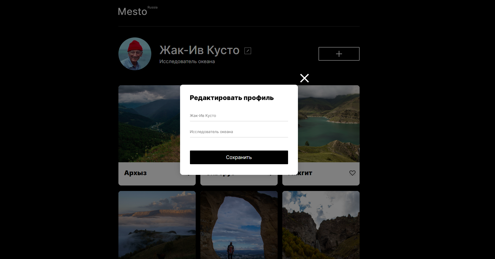

# Проект: Место
_______

Адаптивный сайт, созданный по макету Figma. Сайт оптимизирован для просмотра на экранах от 320 пикселей.
Файловая структура CSS организована по методологии БЭМ. 

---

## Стек

* HTML
* CSS
* JavaScript

## Реализация

* Grid Layout
* Flexbox-вёрстка
* Медиазапросы
* Popup

---
[ссылка на проект]https://karolina-kovdya.github.io/mesto/
